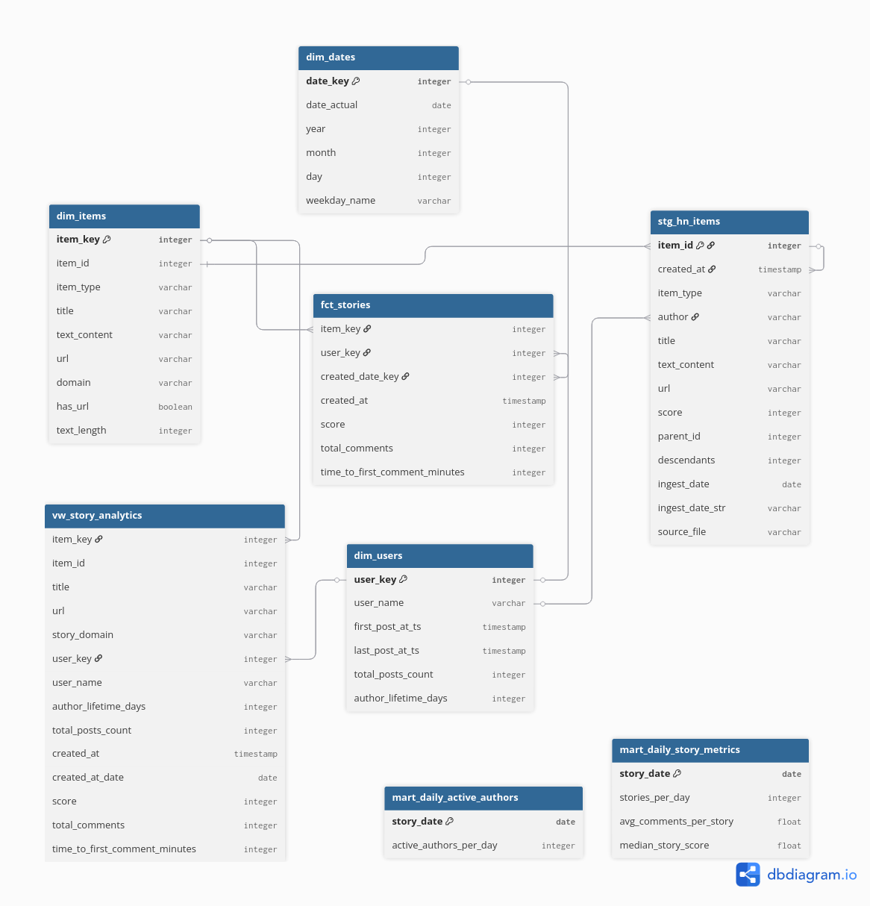

# Hacker News Analytics Platform

A comprehensive, end-to-end data platform that extracts, models, and visualizes trends from Hacker News. This project demonstrates a modern data stack on Google Cloud, implementing an ELT architecture with automated orchestration and robust data governance.

---

## Table of Contents

1. [Overview](#1-overview)
2. [Problem Statement & Project Goals](#2-problem-statement--project-goals)
3. [Architecture](#3-architecture)
4. [Data Warehouse Modeling (Star Schema)](#4-data-warehouse-modeling-star-schema)
5. [Tech Stack](#5-tech-stack)
6. [Key Features](#6-key-features)
7. [Live Dashboard](#7-live-dashboard)
8. [Project Structure](#8-project-structure)
9. [Setup & Installation](#9-setup--installation)
10. [How to Reproduce](#10-how-to-reproduce)
11. [Acknowledgments](#11-acknowledgments)
12. [License](#12-license)

---

## 1. Overview

This project provides a scalable and automated solution for analyzing Hacker News data. It ingests raw data from the [official Hacker News API](https://github.com/HackerNews/API), processes it through a multi-layered data platform (Bronze, Silver, Gold), and presents key business metrics on an interactive BI dashboard. The entire infrastructure is managed as code, and the pipeline is orchestrated for daily refreshes.

## 2. Problem Statement & Project Goals

### The Core Challenge

Hacker News is a dynamic platform with a high volume of ephemeral data. While its API provides access to raw items, it is not designed for analytical workloads. Any individual or organization aiming to understand trends, identify key influencers, or analyze content velocity faces significant technical hurdles that prevent them from deriving meaningful insights.

### Key Business Questions

Due to these challenges, stakeholders cannot answer fundamental business questions. This project aims to build a platform that can answer questions such as:

- **Content & Engagement Trends:**

  - What are the top-performing stories right now based on score and comment velocity?
  - How many new stories and active authors are there each day?
  - How quickly does a new story typically get its first interaction?

- **Author & Source Analysis:**

  - Who are the most influential authors based on the cumulative score of their contributions?
  - What are the most popular domains (e.g., `github.com`, `nytimes.com`) being shared on the platform?

- **Community Behavior:**
  - What are the peak hours for comments and story submissions?
  - How does engagement change over the lifetime of a story?

### Expected Outcomes

To address these problems and answer the business questions, this project will deliver two primary outcomes:

1.  **A Curated & Reliable Data Warehouse:**
    A Gold Layer in BigQuery, modeled as a Star Schema. This provides a "single source of truth" that is clean, documented, tested, and optimized for analytical queries. Data Analysts will be able to connect directly to these tables for ad-hoc analysis.

2.  **A Self-Service Analytics Dashboard:**
    An interactive Looker Studio dashboard built on top of the Gold Layer. This dashboard will visualize the key business metrics, allowing non-technical stakeholders like Product Managers to explore trends and answer their own questions without needing to write SQL.

## 3. Architecture

The platform is built on a modern, serverless ELT architecture using a Medallion (Bronze, Silver, Gold) framework. All infrastructure is provisioned via Terraform, and pipelines are orchestrated by Prefect.

_For a detailed breakdown of the architecture, components, and data flow, please see the **[Architecture Documentation](./docs/architecture.md)**._


## 4. Data Warehouse Modeling (Star Schema)

The analytical core of this platform is built on a **Star Schema**, a dimensional modeling approach optimized for analytics.
It organizes data into **fact tables** (quantitative measures such as story scores and comment counts) and **dimension tables** (contextual attributes such as authors, dates, and item metadata).
This structure enables efficient aggregation, fast queries, and intuitive exploration across business metrics.

**[View Interactive Model on dbdiagram.io →](https://dbdiagram.io/d/HackerNews-Star-Schema-68eb3126d2b621e422679c43)**


## 5. Tech Stack

| Category                   | Technology                  | Purpose                                                    |
| :------------------------- | :-------------------------- | :--------------------------------------------------------- |
| **Cloud Provider**         | Google Cloud Platform (GCP) | Core infrastructure services.                              |
| **Infrastructure as Code** | Terraform                   | Provisioning GCS, BigQuery, IAM.                           |
| **Orchestration**          | Prefect                     | Scheduling and monitoring all data pipelines.              |
| **Data Lake / Staging**    | GCS (Bronze & Silver)       | Storage for raw JSON and optimized Parquet files.          |
| **Data Warehouse**         | BigQuery (Gold)             | Storage for curated, business-ready data models.           |
| **Transformation**         | dbt                         | Data modeling, testing, and documentation (Silver → Gold). |
| **Business Intelligence**  | Looker Studio               | Interactive dashboarding and visualization.                |
| **Core Language**          | Python                      | Extraction scripts and orchestration logic.                |

_For more detailed decisions, please see the **[ADR directory](./docs/architectural_decision_adrs.md)**._

## 6. Key Features

- **Automated ELT Pipeline:** End-to-end orchestration from data ingestion to BI.
- **Dimensional Modeling:** Gold layer is modeled as a Star Schema for optimized analytics.
- **Infrastructure as Code:** Fully reproducible environment managed by Terraform.

## 7. Live Dashboard

The final output of this project is an interactive Looker Studio dashboard that visualizes key trends and metrics.

_See the **[Dashboard Documentation](./docs/dashboard.md)** for a guide on how to interpret the charts._

[](https://lookerstudio.google.com/s/i3d2np2Q1SU)

_Please be aware that historical data collection for this project started on August 23, 2025. As a result, lifetime metrics such as "Author Lifetime Days" are calculated based on activity observed since this date and may not represent the full history of an author on Hacker News._

## 8. Project Structure

The repository follows a modular, layered structure reflecting the Medallion architecture (Bronze → Silver → Gold). Each directory encapsulates a single responsibility - from data ingestion to transformation, orchestration, and documentation.

```
.
├── dbt_hacker_news/           # dbt project - all SQL models, tests, and configs for Silver → Gold
│   ├── dbt_project.yml        # Core dbt project configuration
│   ├── models/
│   │   ├── sources.yml        # Defines external data sources (Silver)
│   │   ├── staging/           # Cleans and standardizes raw data (stg_hn_items)
│   │   └── marts/             # Organized into subfolders for star schema modeling
│   │       ├── dimensions/    # Dimension tables (users, items, dates)
│   │       ├── facts/         # Fact tables (stories)
│   │       └── bi/            # BI-ready denormalized views
|   |
│   ├── packages.yml           # External dbt package dependencies (e.g., dbt-utils)
│   └── README.md
│
├── docs/                      # Project documentation and architectural references
│   ├── guides/                # Step-by-step implementation guides (01–08)
│   ├── images/                # Architecture, diagrams, screenshots
│   ├── architecture.md        # High-level architectural overview
│   ├── dashboard.md           # BI dashboard explanation
│   ├── BUSINESS_REQUIREMENTS.md
│   ├── architectural_decision_adrs.md  # Design rationale and trade-offs
│   └── ...
│
├── extractor/                 # Python module for fetching and preprocessing Hacker News data
│   ├── src/                   # Main logic (API client, GCS utilities, processing)
│   └── test/                  # Unit tests for extraction logic
│
├── orchestration/             # Prefect flows managing ELT orchestration and deployments
│   ├── extractor_flow.py      # Extract raw data → Bronze
│   ├── bronze_to_silver_flow.py
│   ├── silver_to_gold_flow.py
│   └── create_variables.py
│
├── transformation/            # Python-based transformation scripts (Bronze → Silver)
│   ├── create_external_table_silver.py
│   └── run_bronze_to_silver.py
│
├── terraform/                 # Infrastructure as Code for provisioning GCP resources
│   ├── main.tf
│   ├── variables.tf
│   ├── outputs.tf
│   ├── providers.tf
│   └── versions.tf
│
├── scripts/                   # Utility shell scripts for environment setup and automation
│   └── generate_env.sh
│
├── prefect.yaml               # Prefect deployment and flow configuration
├── requirements.txt           # Python dependencies
├── .pre-commit-config.yaml    # Linting and formatting hooks
├── .gitignore                 # Git ignore rules
└── README.md                  # Primary documentation entry point
```

## 9. Setup & Installation

This section guides you through the one-time setup required to prepare your local environment for deploying and running the project.

### Prerequisites

Before you begin, ensure you have the following tools installed and configured on your local machine:

- **Google Cloud SDK (`gcloud`):** The command-line tool for interacting with GCP.
- **Terraform CLI:** Version 1.0 or higher, for managing infrastructure.
- **Python:** Version 3.9 or higher, along with `pip` and `venv` for managing dependencies.
- **dbt Core:** The command-line interface for dbt.

### Installation & Configuration Steps

#### 1. Clone the Repository

```bash
git clone https://github.com/tanmaivan/hn-pipeline.git
cd hn-pipeline
```

#### 2. Authenticate with Google Cloud

Log in to `gcloud` and set up Application Default Credentials (ADC). This allows all tools (Terraform, Python scripts, dbt) to securely authenticate with your GCP account.

```bash
gcloud auth application-default login
gcloud config set project your-gcp-project-id
```

#### 3. Set up Python Environment

Create a dedicated virtual environment for the project and install all required Python packages.

```bash
python -m venv venv
source venv/bin/activate
pip install -r requirements.txt
```

#### 4. Configure dbt Profile

dbt requires a `profiles.yml` file to connect to BigQuery. While our Prefect flows generate this dynamically, you need a local version for manual `dbt` commands and testing. Create a file at `~/.dbt/profiles.yml` with the following content, replacing the placeholder values:

```yaml
dbt_hacker_news:
  target: dev
  outputs:
    dev:
      type: bigquery
      method: oauth # Uses your gcloud ADC
      project: your-gcp-project-id
      dataset: hn_dev_gold # A default dataset
      location: US # Your GCP region
      threads: 4
```

#### 5. Authenticate with Prefect Cloud

Log in to your Prefect Cloud workspace. This will allow you to deploy and monitor your flows.

```bash
prefect cloud login
```

Your local environment is now fully configured and ready. To deploy the infrastructure and run the pipelines, please proceed to the **[How to Reproduce](#10-how-to-reproduce)** section.

## 10. How to Reproduce

This project was built incrementally following a detailed, step-by-step process. Each guide below documents the objectives, key concepts, and implementation details for each major stage of the project.

- [Step 1: Plan, Repository, Governance & Project Scaffold](./docs/guides/01-planning-and-scaffold.md)
- [Step 2: GCP Infrastructure with Terraform](./docs/guides/02-gcp-infrastructure.md)
- [Step 3: Bronze Layer - Raw Data Ingestion](./docs/guides/03-bronze-layer.md)
- [Step 4: Transform 1 - Bronze JSON to Silver Parquet](./docs/guides/04-silver-transformation.md)
- [Step 5: Transform 2 - Silver Layer Modeling](./docs/guides/05-silver-modeling.md)
- [Step 6: Gold Layer - dbt Dimensional Modeling](./docs/guides/06-gold-layer.md)
- [Step 7: BI with Looker Studio](./docs/guides/07-business-intelligence.md)
- [Step 8: Dashboard Export & Resource Cleanup](./docs/guides/08-dashboard-cleanup.md)

## 11. Acknowledgments

This project draws inspiration and technical foundations from multiple open-source and cloud-native ecosystems.
Special acknowledgment to:
- **DataTalksClub** for establishing the foundational frameworks used in the Data Engineering Zoomcamp.
- **Hacker News API** for providing open access to community data.
- **dbt Labs** for pioneering the modern transformation layer.
- **Prefect** for enabling maintainable, observable data orchestration.
- **Terraform** for codifying reproducible infrastructure.
- **Google Cloud Platform** for scalable data services including GCS and BigQuery.

These tools and communities collectively made this end-to-end data platform possible.

## 12. License

This project is licensed under the **MIT License**.
See the [LICENSE](./LICENSE) file for full terms.
