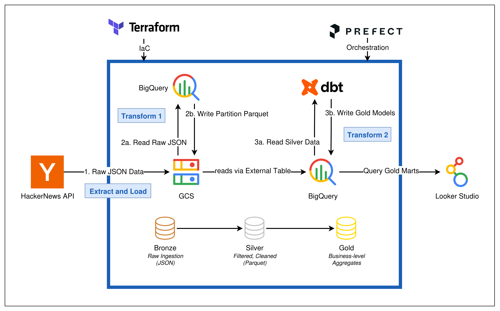
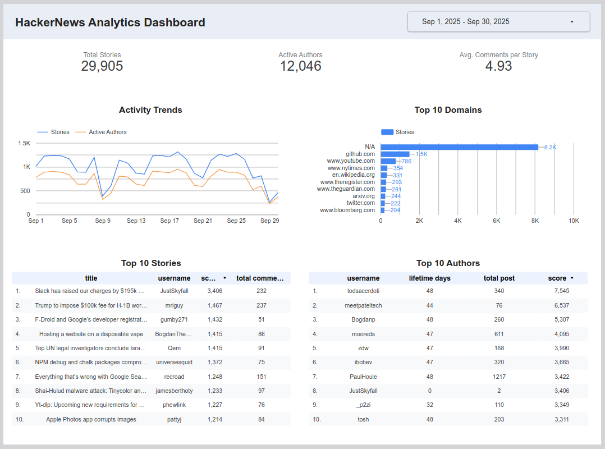

# Hacker News Analytics Platform

A comprehensive, end-to-end data platform that extracts, models, and visualizes trends from Hacker News. This project demonstrates a modern data stack on Google Cloud, implementing an ELT architecture with automated orchestration and robust data governance.

---

## Table of Contents

1. [Overview](#1-overview)
2. [Problem Statement & Project Goals](#2-problem-statement--project-goals)
3. [Architecture](#3-architecture)
4. [Tech Stack](#4-tech-stack)
5. [Key Features](#5-key-features)
6. [Live Dashboard](#6-live-dashboard)
7. [Project Structure](#7-project-structure)
8. [Setup & Installation](#8-setup--installation)
9. [How to Reproduce](#9-how-to-reproduce)
10. [Architectural Decisions (ADRs)](#10-architectural-decisions-adrs)
11. [Contributing](#11-contributing)
12. [License](#12-license)

---

### 1. Overview

This project provides a scalable and automated solution for analyzing Hacker News data. It ingests raw data from the official API, processes it through a multi-layered data platform (Bronze, Silver, Gold), and presents key business metrics on an interactive BI dashboard. The entire infrastructure is managed as code, and the pipeline is orchestrated for daily refreshes.

### 2. Problem Statement & Project Goals

#### The Core Challenge

Hacker News is a dynamic platform with a high volume of ephemeral data. While its API provides access to raw items, it is not designed for analytical workloads. Any individual or organization aiming to understand trends, identify key influencers, or analyze content velocity faces significant technical hurdles that prevent them from deriving meaningful insights.

#### Key Business Questions

Due to these challenges, stakeholders cannot answer fundamental business questions. This project aims to build a platform that can answer questions such as:

- **Content & Engagement Trends:**

  - What are the top-performing stories right now based on score and comment velocity?
  - How many new stories and active authors are there each day?
  - How quickly does a new story typically get its first interaction?

- **Author & Source Analysis:**

  - Who are the most influential authors based on the cumulative score of their contributions?
  - What are the most popular domains (e.g., `github.com`, `nytimes.com`) being shared on the platform?

- **Community Behavior:**
  - What are the peak hours for comments and story submissions?
  - How does engagement change over the lifetime of a story?

#### Expected Outcomes

To address these problems and answer the business questions, this project will deliver two primary outcomes:

1.  **A Curated & Reliable Data Warehouse:**
    A Gold Layer in BigQuery, modeled as a Star Schema. This provides a "single source of truth" that is clean, documented, tested, and optimized for analytical queries. Data Analysts will be able to connect directly to these tables for ad-hoc analysis.

2.  **A Self-Service Analytics Dashboard:**
    An interactive Looker Studio dashboard built on top of the Gold Layer. This dashboard will visualize the key business metrics, allowing non-technical stakeholders like Product Managers to explore trends and answer their own questions without needing to write SQL.

### 3. Architecture

The platform is built on a modern, serverless ELT architecture using a Medallion (Bronze, Silver, Gold) framework. All infrastructure is provisioned via Terraform, and pipelines are orchestrated by Prefect.

_For a detailed breakdown of the architecture, components, and data flow, please see the **[Architecture Documentation](./docs/architecture.md)**._



### 4. Tech Stack

| Category                   | Technology                  | Purpose                                                     |
| :------------------------- | :-------------------------- | :---------------------------------------------------------- |
| **Cloud Provider**         | Google Cloud Platform (GCP) | Core infrastructure services.                               |
| **Infrastructure as Code** | Terraform                   | Provisioning GCS, BigQuery, IAM.                            |
| **Orchestration**          | Prefect                     | Scheduling and monitoring all data pipelines.               |
| **Data Lake / Staging**    | GCS (Bronze & Silver)       | Storage for raw JSON and optimized Parquet files.           |
| **Data Warehouse**         | BigQuery (Gold)             | Storage for curated, business-ready data models.            |
| **Transformation**         | dbt                         | Data modeling, testing, and documentation (Silver -> Gold). |
| **Data Governance**        | Google Data Catalog         | Centralized metadata discovery and management.              |
| **Business Intelligence**  | Looker Studio               | Interactive dashboarding and visualization.                 |
| **Core Language**          | Python                      | Extraction scripts and orchestration logic.                 |

_For more detailed decisions, please see the **[ADR directory](./docs/architectural_decision_adrs.md)**._

### 5. Key Features

- **Automated ELT Pipeline:** End-to-end orchestration from data ingestion to BI.
- **Dimensional Modeling:** Gold layer is modeled as a Star Schema for optimized analytics.
- **Data Governance:** Automated metadata synchronization between dbt and Google Data Catalog.
- **Infrastructure as Code:** Fully reproducible environment managed by Terraform.

### 6. Live Dashboard

The final output of this project is an interactive Looker Studio dashboard that visualizes key trends and metrics.

_See the **[Dashboard Documentation](./docs/dashboard.md)** for a guide on how to interpret the charts._

**[View Live Dashboard →](https://lookerstudio.google.com/s/i3d2np2Q1SU)**

[](https://lookerstudio.google.com/s/i3d2np2Q1SU)

_Please be aware that historical data collection for this project started on August 23, 2025. As a result, lifetime metrics such as "Author Lifetime Days" are calculated based on activity observed since this date and may not represent the full history of an author on Hacker News._

### 7. Project Structure

The repository is organized into distinct directories, each with a specific responsibility.

_For a detailed explanation of each directory, please see the **[Repository Structure Guide](./docs/repository_structure.md)**._

### 8. Setup & Installation

This section guides you through the process of setting up your local environment to run and develop this project.

#### Prerequisites

Before you begin, ensure you have the following tools installed and configured:

- **Google Cloud SDK (`gcloud`):** Authenticated to your GCP account (`gcloud auth application-default login`).
- **Terraform CLI:** Version 1.0 or higher.
- **Python:** Version 3.9 or higher, with `pip` and `venv`.
- **dbt Core:** The command-line interface for dbt.
- **Docker:** (Optional, for running Marquez if you choose to implement lineage).

#### Installation Steps

1.  **Clone the Repository:**

    ```bash
    git clone https://github.com/tanmaivan/hn-pipeline.git
    cd hn-pipeline
    ```

2.  **Set up Python Environment:**
    Create and activate a virtual environment.

    ```bash
    python -m venv venv
    source venv/bin/activate
    ```

3.  **Install Dependencies:**
    Install all required Python packages.

    ```bash
    pip install -r requirements.txt
    ```

4.  **Configure dbt Profile:**
    Set up your dbt profile to connect to BigQuery. Your `~/.dbt/profiles.yml` should contain a profile named `dbt_hacker_news` pointing to your GCP project and target dataset. Refer to the [dbt BigQuery Setup Guide](https://docs.getdbt.com/docs/core/connect-data-platform/bigquery-setup) for details.

### 9. How to Reproduce

Once your local environment is set up, follow these steps to deploy the infrastructure and run the end-to-end pipeline.

1.  **Provision GCP Infrastructure:**
    Navigate to the Terraform directory and apply the configuration. This will create all necessary GCS buckets, BigQuery datasets, and IAM roles.

    ```bash
    cd infra/terraform
    terraform init
    terraform apply
    ```

2.  **Run the dbt Project:**
    Navigate to the dbt project directory, install dependencies, and run the models. This builds the Gold layer in BigQuery.

    ```bash
    cd ../../dbt_hacker_news
    dbt deps
    dbt run
    dbt test
    ```

3.  **Run the Prefect Pipelines:**
    The orchestration is managed via a central deployment script. From the project root, run the following command to start the Prefect server, which will begin executing the `extractor` and `bronze-to-silver` flows based on their schedules.
    ```bash
    python orchestration/deploy.py
    ```
    You can also trigger flows manually for testing via the Prefect UI or by running the individual flow files.
