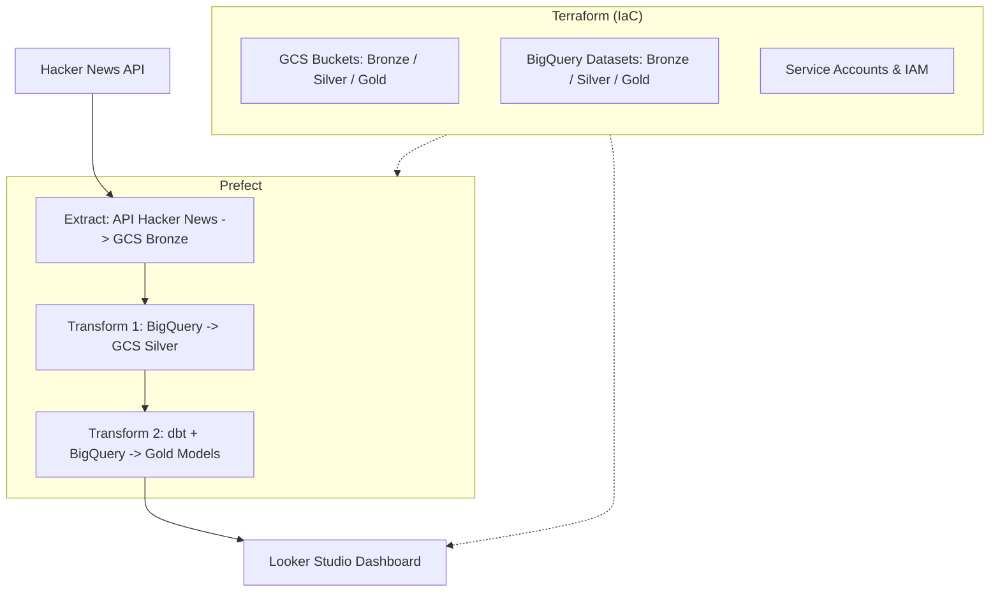

```mermaid
flowchart TD
  %% Foundation Layer
  subgraph Terraform["Terraform (IaC)"]
    direction TB
    infra1[GCS Buckets: Bronze / Silver / Gold]
    infra2[BigQuery Datasets: Bronze / Silver / Gold]
    infra3[Service Accounts & IAM]
  end

  %% Orchestration Layer
  subgraph Prefect["Prefect"]
    direction TB
    extract[Extract: API Hacker News -> GCS Bronze]
    transform1[Transform 1: BigQuery -> GCS Silver]
    transform2[Transform 2: dbt + BigQuery -> Gold Models]
  end

  %% Presentation
  Looker[Looker Studio Dashboard]

  %% Data Flow
  API[Hacker News API] --> extract
  extract --> transform1
  transform1 --> transform2
  transform2 --> Looker

  %% Infrastructure foundation links
  Terraform -.-> Prefect
  Terraform -.-> Looker

```
