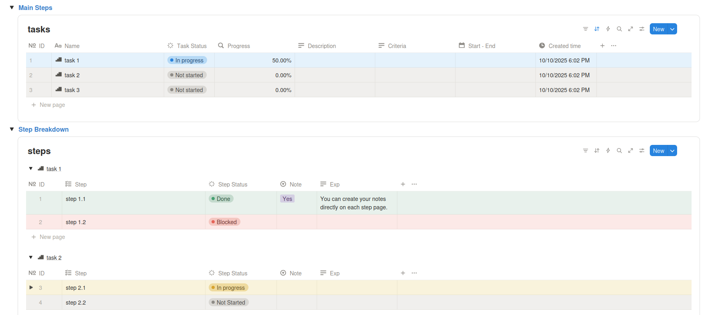

## Step 1: Plan, Repository, Governance & Project Scaffold

### Objective

This initial step serves as the foundation for the entire project. The primary objective is to establish a robust and consistent structure from the outset. This includes comprehensive project planning, initializing a version-controlled repository, and configuring essential governance tools. Completing this stage ensures that the project remains maintainable, the code quality stays high, and collaboration is streamlined.

### 1. Project Planning

A detailed plan is essential for defining the project's scope, objectives, and the sequence of tasks required for completion. For this project, we use Notion to outline and track our progress. This centralizes key project information and provides a clear roadmap for development.

A public template of this plan is available for duplication and reuse:

- **Project Plan Template:** [https://tmv-project-plan.notion.site/project-plan-template](https://tmv-project-plan.notion.site/project-plan-template)



Key sections within this plan include the project description, a preliminary architectural sketch, our standard naming conventions, and a breakdown of main steps into smaller, manageable subtasks.

### 2. Naming Conventions

To maintain clarity and enable automation, I adhere to a strict set of naming conventions across all project assets. This practice is critical for ensuring that resources are easily identifiable and that scripts can reliably reference infrastructure components.

| Resource                   | Convention                                         | Example                            |
| :------------------------- | :------------------------------------------------- | :--------------------------------- |
| **Project Name**           | `hackernews`                                       | `hackernews`                       |
| **Terraform State Bucket** | `hn-pipeline-<env>-tfstate`                        | `hn-pipeline-dev-tfstate`          |
| **GCS Buckets**            | `hn-<env>-<layer>-bucket`                          | `hn-dev-bronze-bucket`             |
| **BigQuery Datasets**      | `hn_<layer>_<env>`                                 | `hn_silver_dev`                    |
| **BigQuery Tables**        | `snake_case` with layer prefixes                   | `stg_...`, `dim_...`, `fct_...`    |
| **dbt Models**             | Files in `models/` with layer prefixes             | `models/staging/stg_...`           |
| **Git Branches**           | `main`, `dev`, `feature/<desc>`, `bugfix/<ticket>` | `feature/add-dbt-snapshots`        |
| **Commit Messages**        | Conventional Commits                               | `feat:`, `fix:`, `docs:`, `chore:` |

### 3. Repository & Environment Setup

These are the initial technical steps required to initialize the project on a local machine and prepare it for development.

- **Create GitHub Repo & Local Project:** First, create a new repository on GitHub. Then, clone this repository to your local machine and navigate into the newly created project directory.

- **Create a Virtual Environment:** It is a best practice to use a virtual environment to isolate project-specific dependencies from your global Python installation. This prevents version conflicts and ensures a reproducible environment.

  ```bash
  # Create a virtual environment named 'venv'
  python -m venv venv

  # Activate the virtual environment
  # On macOS/Linux:
  source venv/bin/activate
  # On Windows:
  # venv\Scripts\activate
  ```

- **Create `requirements.txt`:** Even before installing any packages, it is useful to create an empty `requirements.txt` file. This file will be populated as dependencies are added, serving as a manifest for the project's Python packages.
  ```bash
  pip freeze > requirements.txt
  ```

### 4. Pre-commit Hooks Setup

#### What is Pre-commit?

Pre-commit is a framework that manages and executes checks, known as hooks, before a commit is created. Integrating this tool into our workflow automates quality control and enforces consistency across the codebase. It helps ensure that all committed code meets our standards for formatting, quality, and security by running checks automatically. This prevents common errors and secrets from being introduced into the version history.

#### Implementation Guide

For full details, you can always refer to the official documentation at [https://pre-commit.com/](https://pre-commit.com/).

- **Installation:**

  ```bash
  pip install pre-commit
  ```

- **Create Configuration File:** Create a file named `.pre-commit-config.yaml` in the project root. This file defines the set of hooks that will be executed. The configuration below includes checks for file hygiene, code formatting with Black, linting with Ruff, and secret detection with Gitleaks.

  ```yaml
  # .pre-commit-config.yaml
  default_language_version:
    python: python3.9

  repos:
    # 1. Basic File Hygiene
    - repo: https://github.com/pre-commit/pre-commit-hooks
      rev: v4.6.0
      hooks:
        - id: check-added-large-files
        - id: check-json
        - id: check-merge-conflict
        - id: check-yaml
        - id: end-of-file-fixer
        - id: trailing-whitespace

    # 2. Python Code Formatter (Black)
    - repo: https://github.com/psf/black
      rev: 24.4.2
      hooks:
        - id: black

    # 3. Python Linter (Ruff)
    - repo: https://github.com/astral-sh/ruff-pre-commit
      rev: v0.4.4
      hooks:
        - id: ruff
          args: [--fix]

    # 4. Secret Detection (Gitleaks)
    - repo: https://github.com/gitleaks/gitleaks
      rev: v8.18.2
      hooks:
        - id: gitleaks
  ```

- **Install the Git Hooks:** This command installs the pre-commit script into your repository's local `.git/hooks` directory. It must be run once per project clone to activate the hooks.

  ```bash
  pre-commit install
  ```

- **Initial Run & Updates:**
  - To run the hooks against all files for the first time or to check the entire repository:
    ```bash
    pre-commit run --all-files
    ```
  - To automatically update the hook versions in your configuration file to the latest available:
    ```bash
    pre-commit autoupdate
    ```

### 5. Git Workflow Setup

- **Create a `dev` Branch:** Our branching model designates `main` as the stable, production-ready branch. All development work should be done on feature branches that originate from a `dev` branch.

  ```bash
  # From the 'main' branch, create a new branch named 'dev' and switch to it
  git checkout -b dev
  ```

- **Configure Branch Protection for `main`:** Branch protection is a set of rules configured in GitHub to safeguard critical branches. It prevents irreversible actions like force pushes and requires that all changes go through a formal review process. To configure it, navigate to your repository's settings on GitHub and add a protection rule for the `main` branch. Key settings to enable include requiring a pull request with at least one approval before merging. For a detailed guide, refer to the official GitHub documentation on [protected branches](https://docs.github.com/en/repositories/configuring-branches-and-merges-in-your-repository/managing-protected-branches/about-protected-branches).

---

[> Next Step: Step 2 - GCP Infrastructure with Terraform](./02-gcp-infrastructure.md)
