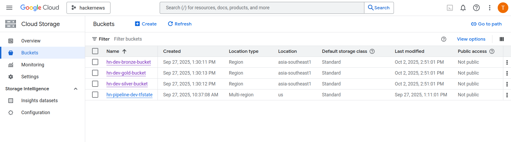

### Step 2: GCP Infrastructure with Terraform

#### Objective

This step focuses on provisioning the entire cloud infrastructure required for the project using Terraform. By defining our infrastructure as code (IaC), we ensure a reproducible, version-controlled, and automated setup. This eliminates manual configuration, reduces the risk of errors, and allows us to easily manage the lifecycle of our cloud resources.

#### 1\. Google Cloud Project Setup

Before we can use Terraform, a Google Cloud Platform (GCP) project must exist and be configured for billing. This is a one-time manual setup.

- **Create a GCP Project:** Follow the official guide to create a new project via the [GCP Console](https://console.cloud.google.com/). You can find detailed instructions in the [GCP documentation](https://cloud.google.com/resource-manager/docs/creating-managing-projects).
- **Enable Billing:** A project must be linked to a billing account to use GCP services. Ensure billing is enabled for your newly created project. More information is available in the [Google Cloud Billing documentation](https://cloud.google.com/billing/docs).
- **Authenticate the gcloud CLI:** For local development, we will authenticate using Application Default Credentials (ADC). This is the simplest method and allows Terraform and other tools to use your personal user credentials to access GCP. Run the following command and follow the browser-based authentication flow. The necessary tools like `gsutil` are included with the gcloud CLI.

  ```bash
  gcloud auth application-default login
  ```

#### 2\. What is Terraform?

Terraform is an open-source Infrastructure as Code (IaC) tool created by HashiCorp. It allows you to safely and predictably create, change, and improve infrastructure. Instead of using a graphical user interface to configure resources, you write configuration files that describe the desired state of your infrastructure. Terraform then works out a plan to achieve that state and executes it. This approach makes infrastructure management more transparent, repeatable, and less prone to human error.

To install the Terraform CLI, follow the official tutorial for your operating system available at the [HashiCorp Developer portal](https://developer.hashicorp.com/terraform/tutorials/aws-get-started/install-cli).

#### 3\. Creating the Terraform Remote State Bucket

A critical best practice when working with Terraform is to manage its state file remotely. The state file is a JSON file that keeps track of the resources Terraform manages. Storing it in a remote GCS bucket, rather than on your local machine, provides a single source of truth, enables collaboration, and prevents accidental loss of the state.

**Create the GCS Bucket:** We will use `gsutil` to create a bucket that will store our Terraform state file. The following commands create the bucket, enable uniform access control, and turn on versioning as a safeguard against accidental state deletion.

```bash
# Replace with your desired environment name, e.g., 'dev'
TFSTATE_BUCKET="hn-pipeline-dev-tfstate"

# Get your current GCP Project ID from gcloud config
GCP_PROJECT_ID=$(gcloud config get-value project)

# Create the bucket
gsutil mb -p $GCP_PROJECT_ID -l US gs://$TFSTATE_BUCKET

# Enforce uniform bucket-level access
gsutil uniformbucketlevelaccess set on gs://$TFSTATE_BUCKET

# Enable versioning to keep a history of your state file
gsutil versioning set on gs://$TFSTATE_BUCKET
```

#### 4\. Writing the Terraform Configuration

Our Terraform code is organized into several files within the `infra/terraform` directory, each with a specific purpose.

- `versions.tf`: Declares the required Terraform version and the providers needed for the project, such as the Google Cloud provider.
- `providers.tf`: Configures the Google Cloud provider, specifying the project and region. It also configures the remote backend to use the GCS bucket we created earlier for storing the state file.
- `variables.tf`: Defines the input variables for our configuration, like `project_id` and `env`. This makes our code reusable and configurable.
- `dev.tfvars`: A variable definitions file that assigns specific values for the `dev` environment. This file is used to pass variables to our plan without hardcoding them.
- `main.tf`: The core file where all the GCP resources are defined.
- `outputs.tf`: Declares the output values from our resources, such as bucket names and dataset IDs, which can be easily queried after deployment.

##### Resource Definitions in `main.tf`

The `main.tf` file defines all the resources needed for our data platform.

**Enable Required APIs:** This block ensures that all necessary GCP APIs are enabled for our project before any resources that depend on them are created. It iterates over a set of service names and enables each one.

```terraform
# --- Provider configuration ---
resource "google_project_service" "required_apis" {
  for_each = toset([
    "storage.googleapis.com",
    "bigquery.googleapis.com",
    # ... (rest of the APIs)
  ])
  project = var.project_id
  service = each.key
  disable_on_destroy = false
}
```

**GCS Buckets:** We define four GCS buckets, one for each layer of our Medallion architecture (Bronze, Silver, Gold) and one to store our code artifacts. The bronze bucket has a lifecycle rule to automatically delete raw data after 30 days to manage costs.

```terraform
# --- Buckets ---
resource "google_storage_bucket" "bronze_bucket" {
  name          = "hn-dev-bronze-bucket"
  # ... (rest of the config)
}

resource "google_storage_bucket" "silver_bucket" {
  # ...
}
# ... (and so on for gold and code buckets)
```

**BigQuery Datasets:** Three BigQuery datasets are created, corresponding to the Bronze, Silver, and Gold layers. The schema names are derived from the project's naming conventions.

```terraform
# --- BigQuery Datasets ---
resource "google_bigquery_dataset" "bronze_dataset" {
  dataset_id = "hn_bronze_dev"
  # ... (rest of the config)
}
# ... (and so on for silver and gold datasets)
```

**Service Account and IAM Bindings:** A dedicated service account is created for the pipeline to interact with GCP services. It is then granted the necessary IAM roles on the buckets and BigQuery datasets, following the principle of least privilege.

```terraform
# --- Service Account for the Pipeline Worker ---
resource "google_service_account" "pipeline_worker_sa" {
  # ...
}

# --- IAM Bindings for Service Account ---
resource "google_storage_bucket_iam_member" "bronzer_writer" {
  # ...
}
# ... (and so on for all other IAM bindings)
```

#### 5\. Applying the Terraform Configuration

With the configuration files in place, we can now provision the infrastructure.

**Initialize Terraform:** This command initializes the working directory, downloading the necessary provider plugins and configuring the backend.

```bash
terraform init
```

**Create an Execution Plan:** The `plan` command creates an execution plan, showing what actions Terraform will take to achieve the desired state. We save this plan to a file to ensure that only what was planned is applied.

```bash
terraform plan -var-file="dev.tfvars" -out="dev.plan"
```

**Apply the Plan:** This command executes the actions defined in the saved plan file, creating all the resources in your GCP project.

```bash
terraform apply "dev.plan"
```

After the `apply` command completes, all your infrastructure is live. You can verify the created resources directly in the GCP Console.



---

[< Previous Step: Step 1 - Plan, Repository, Governance & Project Scaffold](./01-planning-and-scaffold.md)

[> Next Step: Step 3 - Bronze Layer: Raw Data Ingestion](./03-bronze-layer.md)
