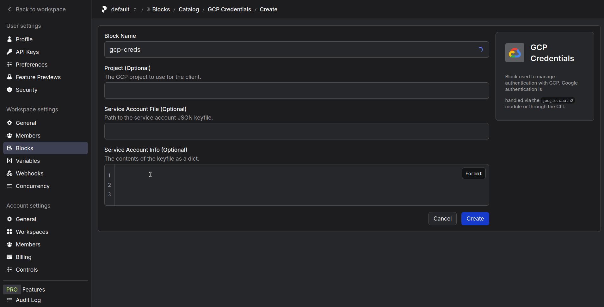
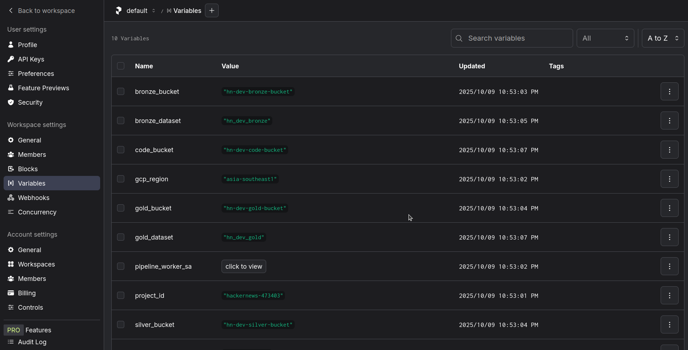
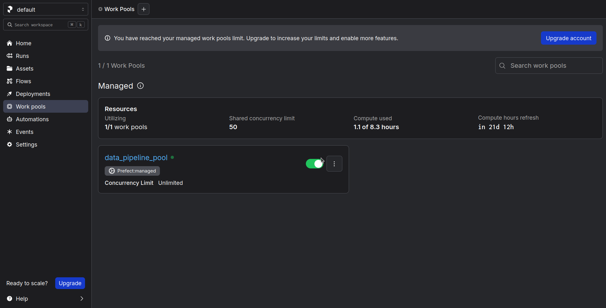
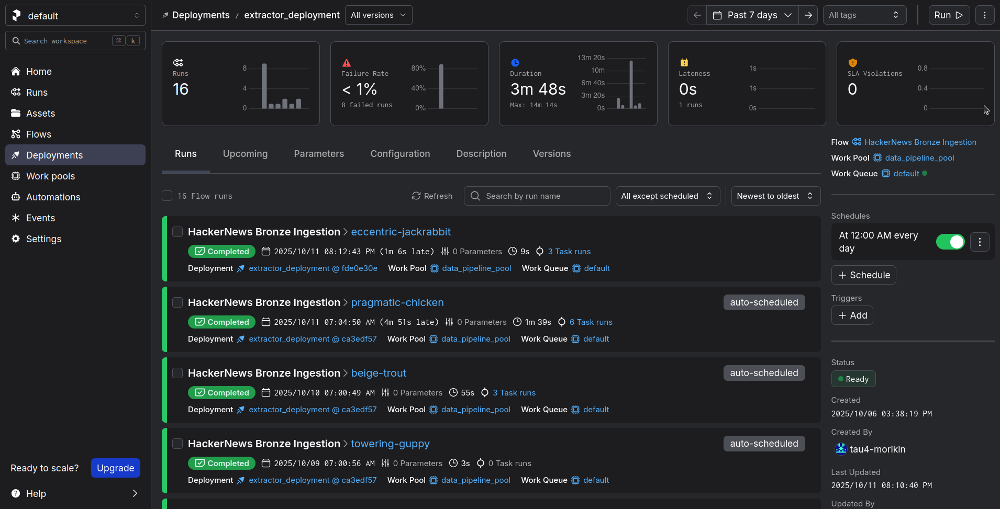
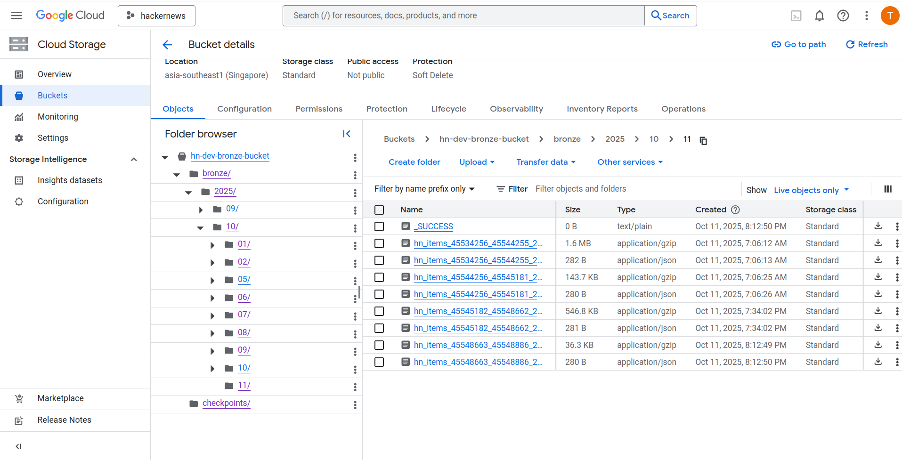

## Step 3: Bronze Layer - Raw Data Ingestion

### Objective

The objective of this step is to build a robust and automated pipeline to extract raw data from the Hacker News API and load it into our Bronze layer in Google Cloud Storage (GCS). This raw layer serves as our immutable, single source of truth. We will integrate the Prefect orchestration tool from the beginning to manage scheduling, execution, and monitoring of this pipeline.

### 1. Core Logic & Implementation

Instead of developing the pipeline directly within the orchestration tool, the core logic was first developed as modular Python functions and tested independently. This test-driven development (TDD) approach, guided by the tests in the `extractor/test/` directory, ensures that each component is reliable before being assembled into a full pipeline.

The core logic is divided into three main components:

**HN Client (`extractor/src/hn_client.py`)**
This module is responsible for all communication with the Hacker News API. It is designed to be resilient, using the `tenacity` library to automatically retry on temporary network or server errors. It handles fetching individual items, finding the latest item ID (`maxitem`), and fetching items concurrently using a thread pool to maximize throughput while respecting the API.

**Processing Logic (`extractor/src/processing.py`)**
This module handles the in-memory data transformation. Its primary function takes a list of raw item dictionaries, converts them into a newline-delimited JSON (NDJSON) format, and compresses the result into a Gzip stream using `io.BytesIO`. This is a highly efficient approach as it avoids writing temporary files to disk.

**GCS Utilities (`extractor/src/gcs_utils.py`)**
This module contains helper functions for all interactions with Google Cloud Storage. Key functionalities include:

- **Atomic Uploads:** To prevent downstream processes from reading partially written files, it implements an atomic upload pattern. Data is first uploaded to a temporary `_inflight/` location, then copied to its final destination upon success. A `_SUCCESS` file and a `_manifest.json` file are also created to signal completion and provide metadata.
- **Checkpoint Management:** It includes functions to read and write a checkpoint file. This file stores the ID of the last successfully processed item, allowing the pipeline to be fault-tolerant and resume exactly where it left off, preventing data loss or reprocessing.

### 2. Orchestration with Prefect Cloud

We will use Prefect Cloud to orchestrate this extraction pipeline.

#### What is Prefect Cloud?

Prefect Cloud is a fully managed orchestration platform that allows us to schedule, monitor, and manage our dataflows from a central UI.

**Advantages:**

- **Managed Scheduling:** We can set schedules directly in the cloud, and the platform will trigger our flows automatically. This is a significant advantage over a local setup, which would require a machine to be constantly running.
- **Observability:** It provides a rich UI for observing flow runs, viewing logs, and getting notifications on failures.
- **Separation of Infrastructure:** With its hybrid model, our code and data remain within our secure GCP environment. Prefect Cloud only manages the orchestration metadata.

**Limitations:** The free tier has some limitations, such as a single workspace and a limit on concurrent runs. However, for a personal project of this scale, it is more than sufficient.

You can find more information about Prefect in the official Prefect documentation: https://docs.prefect.io/

### 3. Implementation Steps

**Install Dependencies:** Ensure all necessary libraries for the extractor and Prefect are installed.

```bash
pip install prefect prefect-gcp requests tenacity tqdm
```

**Login to Prefect Cloud:** Next, you need to authenticate your local machine with your Prefect Cloud workspace. This command will open a browser window for you to authorize the connection.

```bash
# This command connects your CLI to your Prefect Cloud account
prefect cloud login
```

**Create GCP Credentials Block:** For Prefect to securely authenticate with GCP, we need to create a `GCP Credentials` block. This block will store the service account key file. While this can be done via code, creating it through the UI is more straightforward for a one-time setup.

First, generate a key for your pipeline's service account:

```bash
# Get your pipeline service account email from Terraform output
PIPELINE_SA_EMAIL=$(cd terraform && terraform output -raw pipeline_worker_service_account_email)

# Create a key file
gcloud iam service-accounts keys create gcp-creds.json --iam-account=$PIPELINE_SA_EMAIL
```

Next, create the block in the Prefect Cloud UI:

- Navigate to **Blocks** in the UI.
- Click the `+` button to create a new block and select **GCP Credentials**.
- Set the **Block Name** to `gcp-creds`.
- Copy the entire content of the `gcp-creds.json` file you just created and paste it into the **Service Account Info** field.
- Click **Create**.



**Create Prefect Variables:** To avoid hardcoding values such as bucket names, the pipeline uses Prefect Variables. These variables can be created either via the script `orchestration/create_variables.py` or through the Prefect UI.

To run the script, first generate the `.env` file:

```bash
chmod +x scripts/generate_env.sh
./scripts/generate_env.sh
```

The script reads the `.env` file located at the project root and loads its contents as Prefect Variables for pipeline configuration. After setting up your environment variables, run the script to create Prefect Variables:

```bash
python orchestration/create_variables.py
```

We can see the results in the Prefect UI:



### 4. Assembling the Prefect Flow

With the core logic and configuration in place, we assemble them into a Prefect Flow. Prefect uses decorators (`@task`, `@flow`) to define units of work and their dependencies.

The main idea of the `orchestration/extractor_flow.py` is to:

- Define each logical step (fetch, process, upload) as a separate `@task`.
- Define the main workflow logic inside a `@flow` function.
- The flow begins by loading the GCP credentials from the `gcp-creds` block.
- It then reads the last processed ID from the checkpoint file in GCS.
- It calculates the range of new item IDs to fetch and iterates through them in chunks.
- For each chunk, it calls the `fetch`, `process`, and `upload` tasks in sequence.
- Finally, it updates the checkpoint with the ID of the last item in the processed chunk.

To test the flow locally before deploying it to Prefect Cloud, you can run it directly using the following command:

```bash
python -m orchestration.extractor_flow
```

This executes the flow in your local environment, allowing you to verify that the extraction, processing, and upload steps work as expected before scheduling it in the cloud.

### 5. Deploying the Flow

To run this flow on a schedule using Prefect Cloud, we need to create a deployment. A deployment packages your flow, specifies how it should be executed, and defines its schedule.

#### Create a Work Pool:

A work pool is a logical grouping for your infrastructure that will execute the flow runs. If you don't have one, create it in the Prefect Cloud UI:

- Go to **Work Pools**.
- Click `+` to create a new pool.
- Choose **Prefect Managed**. Give it a name, for example, `managed-python-pool`.



- **Create `prefect.yaml`:** This file defines how to build and deploy your flows. Create a file named `prefect.yaml` in your project root.

```yaml
# prefect.yaml
name: hn-pipeline
prefect-version: 3.4.2 # Or your current Prefect version

build: null
push: null
pull:
  - prefect.deployments.steps.git_clone:
      repository: https://github.com/your-username/your-repo-name.git
      branch: main # Or your current branch
  - prefect.deployments.steps.pip_install_requirements:
      requirements_file: requirements.txt

deployments:
  - name: hn-extractor
    entrypoint: orchestration/extractor_flow.py:extractor_flow
    work_pool:
      name: managed-python-pool # Must match the name of your work pool
    schedule:
      - cron: "0 * * * *" # Run at the beginning of every hour
        timezone: "UTC"
```

This configuration tells Prefect to:

- **pull:** Clone your Git repository and install dependencies from `requirements.txt`.
- **deploy:** Create a deployment named `hn-extractor` from the `extractor_flow` function, assign it to your work pool, and schedule it to run hourly.

- **Apply the Deployment:** From your terminal, run the following command to create the deployment on Prefect Cloud:
  ```bash
  prefect deploy --all
  ```

After applying, you can navigate to the **Deployments** page in the Prefect UI. You will see your `hn-extractor` deployment. From there, you can trigger a "Quick Run" to test it or wait for the schedule to trigger it automatically. You will see the logs from the run streaming into the UI in real-time as data is extracted and loaded into your GCS Bronze bucket.

Overview of the `hn-extractor` deployment in the Prefect UI, showing the scheduled flow and recent runs:



Contents of the Bronze layer bucket in Google Cloud Storage, displaying the uploaded raw Hacker News data:


---

[← Previous: Step 2 - GCP Infrastructure with Terraform](./02-gcp-infrastructure.md)

[Next: Step 4 - Transform 1: Bronze JSON to Silver Parquet →](./04-silver-transformation.md)
