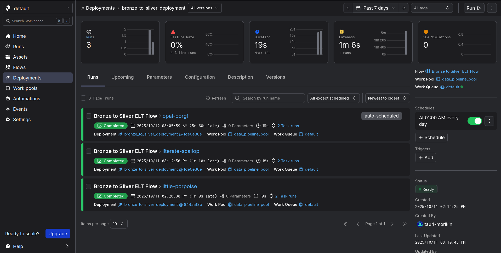
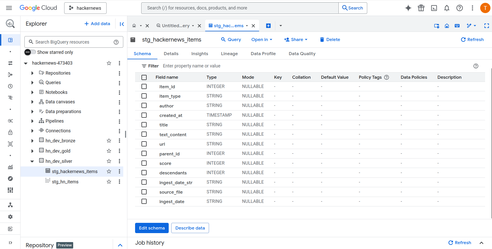
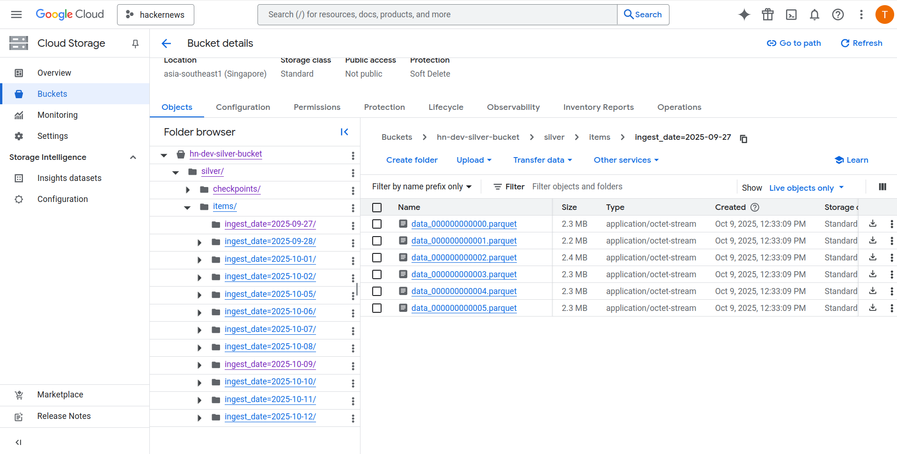

## Step 4: Transform 1 - Bronze JSON to Silver Parquet

### Objective

In this step, we will transform the raw, unstructured JSON data from the Bronze layer into an optimized, columnar Parquet format in the Silver layer. This transformation is crucial for analytical performance and cost efficiency. We will leverage the serverless power of **BigQuery** as our computation engine to perform this transformation. Additionally, we will integrate **Prefect** credentials directly into our transformation script to ensure secure and seamless execution within our orchestration framework.

### 1\. Core Logic: The Transformation Script

The logic for this transformation is encapsulated in the Python script `transformation/run_bronze_to_silver.py`. This script is designed to be idempotent and efficient, implementing a "delta" processing logic to only transform new or changed data.

Here is a breakdown of the key components of the script:

#### Authentication with Prefect

Instead of relying on local environment variables, the script explicitly loads credentials from the `GcpCredentials` block we configured in Prefect Cloud. This ensures that the script can authenticate securely whether it's run locally for testing or remotely by a Prefect worker.

```python
from prefect_gcp import GcpCredentials
gcp_credentials_block = GcpCredentials.load("gcp-creds")
```

#### Dynamic Infrastructure Configuration

The script uses the `python-terraform` library to read outputs directly from our Terraform state. This means the script automatically knows the correct project ID and bucket names without any hardcoding, making it portable across different environments (e.g., dev, prod).

#### Delta Processing Logic via Checkpointing

To avoid re-processing all data every time the pipeline runs, the script implements a smart checkpointing system:

1.  It maintains a JSON checkpoint file in the Silver bucket (`silver/checkpoints/bronze_file_state.json`).
2.  For each date folder in the Bronze bucket, it compares the current file count and total size against the values stored in the checkpoint.
3.  Only dates where differences are found (indicating new or updated data) are added to the `dates_to_process` list.

#### The BigQuery Transformation (ELT)

For each date that needs processing, the script constructs and executes a multi-statement BigQuery SQL script. This is the core **Transform** step of our ELT architecture.

1.  **Create Temporary External Table:** A temporary external table is created pointing specifically to the `.jsonl.gz` files of the date being processed. We use a CSV format hack with a custom delimiter (`§`) to read each line as a single raw string, bypassing BigQuery's strict JSON parsing at the ingestion stage to handle potential schema inconsistencies gracefully.
2.  **Export to Parquet:** The `EXPORT DATA` statement reads from this temporary table. It uses `SAFE.PARSE_JSON` and `JSON_EXTRACT_SCALAR` to parse the raw strings, extract fields, and cast them to the correct data types. The result is written out as Snappy-compressed Parquet files into a Hive-partitioned structure in the Silver bucket (`.../ingest_date=YYYY-MM-DD/`).

### 2. Integrating the Logic into a Prefect Flow

With the core transformation logic encapsulated in Python functions, the next step is to integrate it into a Prefect flow for orchestration. This allows us to manage execution, scheduling, retries, and logging from a central platform.

The flow is defined in `orchestration/bronze_to_silver_flow.py`.

#### Flow Design

The flow is structured with clear separation of concerns, using Prefect's `@task` and `@flow` decorators:

1.  **Configuration Loading:** At the beginning of the flow, it loads necessary configurations, such as the `GcpCredentials` block for authentication and various `Variables` (like project ID and bucket names) that we have set up in the Prefect Cloud UI. This practice decouples the code from specific environment details.

2.  **`run_bronze_to_silver_script` Task:** This task is a direct wrapper around the main Python script we developed. It is responsible for executing the entire Bronze-to-Silver data transformation using BigQuery. It's configured with `retries` to automatically handle transient failures.

3.  **`refresh_silver_external_tables` Task:** After the new Parquet files have been created in the Silver bucket, it's crucial to ensure that BigQuery's external table is aware of them. This task runs a separate script (`transformation/create_external_table_silver.py`) that executes a `CREATE OR REPLACE EXTERNAL TABLE` statement. This makes the newly transformed data immediately queryable for downstream processes like dbt.

4.  **`bronze_to_silver_flow` Flow:** The main `@flow` function orchestrates these tasks in the correct sequence. It first runs the transformation task and, upon its successful completion, runs the task to refresh the external table.

#### Testing the Flow Locally

Before creating a deployment, we can test the entire flow on our local machine to ensure all tasks run correctly and in the intended order.

Assuming your virtual environment is active and Prefect is logged into your workspace, you can execute the flow directly:

```bash
python -m orchestration.bronze_to_silver_flow
```

The terminal will stream logs from the Prefect engine. You will see the start of the flow, followed by the execution of the "Run Bronze to Silver ELT Task" and then the "Refresh Silver External Tables" task, including all the detailed logs from within each script.

### 3\. Deploying the Flow to Prefect Cloud

Once the flow has been tested locally, the final step is to create a deployment on Prefect Cloud. This makes the flow available for scheduled and ad-hoc runs.

#### Update prefect.yaml

We add a new deployment definition to our prefect.yaml file at the project root. This new entry specifies the flow's entry point, the work pool it should run on, and its schedule.

```yaml
# In prefect.yaml, under the 'deployments:' section
- name: bronze-to-silver-deployment
  entrypoint: orchestration/bronze_to_silver_flow.py:bronze_to_silver_flow
  work_pool:
    name: managed-python-pool # Or your specific work pool name
  schedule:
    - cron: "0 1 * * *" # Run daily at 1:00 AM UTC
      timezone: "UTC"
```

#### Apply the Deployment

To create or update all deployments defined in the prefect.yaml file, run the following command from your project root:

```bash
prefect deploy --all
```

After the command succeeds, you can navigate to the **Deployments** page in your Prefect Cloud UI. You will see the new bronze-to-silver-deployment. From here, you can trigger a "**Quick Run**" to test it in the cloud environment or simply let it run on its daily schedule. This completes the automation of the Bronze-to-Silver transformation step.

The deployment in the Prefect UI:



### 4\. Verifying Results on Google Cloud

After a successful run, you should verify the output in your GCS Silver bucket:

- Navigate to your Silver bucket in the Google Cloud Console.
- Go to the path `silver/items/`.
- You will see a series of directories named in the **Hive-partitioning format**: `ingest_date=YYYY-MM-DD`.
- Inside each date directory, you will find one or more `.parquet` files containing the transformed data.

Visualization of the temporary external table created to read raw .jsonl.gz data for the current ingestion date:



Parquet files generated by the transformation process, partitioned by ingest_date, stored in the Silver GCS bucket:



This structure is critical as it allows downstream tools like BigQuery and dbt to efficiently query specific dates without scanning the entire dataset.

With the data now in an optimized format and structure, we are ready to move to the next step: modeling this data with dbt.

---

[← Previous: Step 3 - Bronze Layer: Raw Data Ingestion](03-bronze-layer.md/)

[Next: Step 5 - Transform 2: Silver Layer Modeling with dbt →](05-silver-modeling.md)
