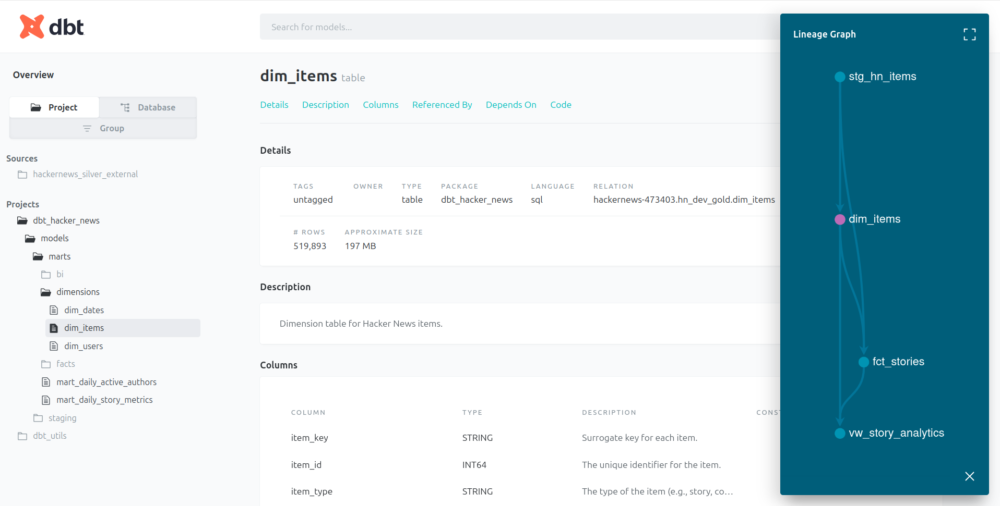

## Step 5: Transform 2 - Silver Layer Data Modeling with dbt

### Objective

With our data cleaned, optimized as Parquet, and residing in the Silver layer, the objective of this step is to transform it into well-defined, business-ready models. We will use **dbt (data build tool)** to implement a robust data modeling layer, enforce data quality, and prepare the data for analytics. This process bridges the gap between technically clean data and meaningful, queryable business insights.

### 1. Introduction to Data Modeling and dbt

#### What is Data Modeling?

Data modeling is the process of structuring data into a logical format that is optimized for a specific purpose. Instead of working with a single, wide, and complex table, we break down our data into smaller, interconnected tables. For analytics, a common and powerful technique is **dimensional modeling**, which organizes data into **fact** and **dimension** tables. This structure makes it easier to ask complex business questions and improves query performance.

#### What is dbt?

dbt (data build tool) is the industry-standard tool for the "T" (Transform) in ELT. It allows us to define our data models using SQL, and it handles all the underlying dependencies, testing, and documentation.

**Key benefits of using dbt:**

- **Transformations as Code:** All logic is written in SQL and version-controlled with Git.
- **Automated Testing:** We can define data quality tests (e.g., uniqueness, not-null constraints) directly in configuration files.
- **Automated Documentation & Lineage:** dbt automatically generates a documentation website and a data lineage graph, showing how data flows through our models.

For this project, we will use the `prefect-dbt` integration library, which provides seamless integration between our orchestrator and dbt. You can find more details in the [official Prefect dbt documentation](https://docs.prefect.io/integrations/prefect-dbt/).

### 2. dbt Project Setup and Configuration

#### Install Dependencies

First, we need to install the necessary dbt adapter for BigQuery and the Prefect integration library.

```bash
pip install dbt-bigquery "prefect-dbt[bigquery]"
```

#### Initialize the dbt Project

Navigate to the project root and run `dbt init`. This command will prompt you for a project name and connection details. This process creates a `~/.dbt/profiles.yml` file to store your credentials.

```bash
dbt init dbt_hacker_news
```

For this project, since we are integrating with Prefect, we will not rely on the default `profiles.yml` for production runs. However, completing this step is useful for local testing. You can configure your local profile similar to this:

```yaml
dbt_hacker_news: # Must match the 'profile' name in dbt_project.yml
  target: dev
  outputs:
    dev:
      type: bigquery
      method: oauth
      project: hackernews-id # Your GCP project ID
      dataset: hn_dev_gold # The default dataset where dbt will create models
      location: US # Your dataset location
      threads: 4
```

#### Configure dbt Packages

dbt can use external packages to extend its functionality. We will use `dbt-utils`, which provides a rich library of macros for common tasks like generating surrogate keys. To do this, we create a `packages.yml` file.

```yaml
# dbt_hacker_news/packages.yml
packages:
  - package: dbt-labs/dbt_utils
    version: 1.1.1 # Or a more recent version
```

After creating the file, run `dbt deps` to install the package.

```bash
cd dbt_hacker_news
dbt deps
```

#### Verify Connection

To ensure everything is configured correctly, run `dbt debug`. If all checks pass with an `OK`, your connection to BigQuery is successful.

### 3. Dimensional Modeling: Building the Star Schema

We will model our data using a **Star Schema**, a mature and highly effective dimensional modeling technique.

A Star Schema consists of a central **Fact Table** surrounded by several **Dimension Tables**.

- **Fact Tables** contain quantitative measurements or "facts" about a business process (e.g., number of comments, score).
- **Dimension Tables** contain descriptive attributes that provide context to the facts (e.g., details about a user, a story, or a specific date).

#### Our Star Schema Design

For the Hacker News data, our Star Schema is designed to answer questions about stories and their authors:


[Click here to view the interactive schema on dbdiagram.io](https://dbdiagram.io/d/HackerNews-Star-Schema-68eb3126d2b621e422679c43)

This is how the models are structured within the `dbt_hacker_news/models/` directory.

- **`sources.yml`**: Defines the entry point for our raw data - the Silver external table.
- **`staging/stg_hn_items.sql`**: A staging model that cleans and renames columns from the source, creating a consistent base for all downstream models.
- **`marts/dimensions/`**: Contains our dimension tables:
  - `dim_items`: One row per item (story, comment), containing descriptive attributes like title and URL.
  - `dim_users`: One row per unique author, containing user-level metrics like their lifetime activity.
  - `dim_dates`: A utility table with one row per day, used for time-based analysis.
- **`marts/facts/fct_stories.sql`**: The central fact table. Each row represents a story and contains numeric measures (score, comment_count) and foreign keys that link to the dimension tables.
- **`marts/bi/vw_story_analytics.sql`**: A final denormalized view that joins the fact and dimension tables together. This view is optimized for BI tools like Looker Studio, providing a single, wide table for easy analysis.

**This view represents the BI-ready structure conceptually, but its actual implementation belongs to the Gold layer, which we will build in the next step.**

### 4. Running the dbt Workflow

After defining all the models, we use a standard set of dbt commands to build, test, and document our data warehouse.

#### dbt run

This is the primary command. It executes the SQL in your model files to create the tables and views in your data warehouse (BigQuery). dbt automatically handles the dependency graph, ensuring that models are built in the correct order (e.g., staging models first, then dimensions, then facts).

```bash
dbt run
```

#### dbt test

This command runs all the data quality tests you have defined in your `schema.yml` files. It checks for things like uniqueness, not-null constraints, and referential integrity (e.g., ensuring every `user_key` in the fact table exists in the dimension table). This is a critical step for ensuring data reliability.

```bash
dbt test
```

#### dbt docs generate

This command compiles all the information from your project (model code, descriptions, tests) into a set of static JSON files. These files are the raw material for the documentation site.

```bash
dbt docs generate
```

#### dbt docs serve

This command launches a local web server that serves a beautiful, interactive documentation website. On this site, you can browse all your models, view their descriptions and tests, and, most importantly, explore the interactive **data lineage graph** that visually shows how all your models are connected.

```bash
dbt docs serve
```

Navigate to `http://localhost:8080` to view the generated dbt documentation site:



This step established a clean and structured analytical foundation using dbt. In the next step, we will extend this foundation into the **Gold Layer**, where we create BI-ready models and visualizations for insight delivery.

---

[← Previous: Step 4 - Transform 1: Bronze JSON to Silver Parquet](./04-silver-transformation.md)

[Next: Step 6 - Gold Layer: dbt Dimensional Modeling →](./06-gold-layer.md)
