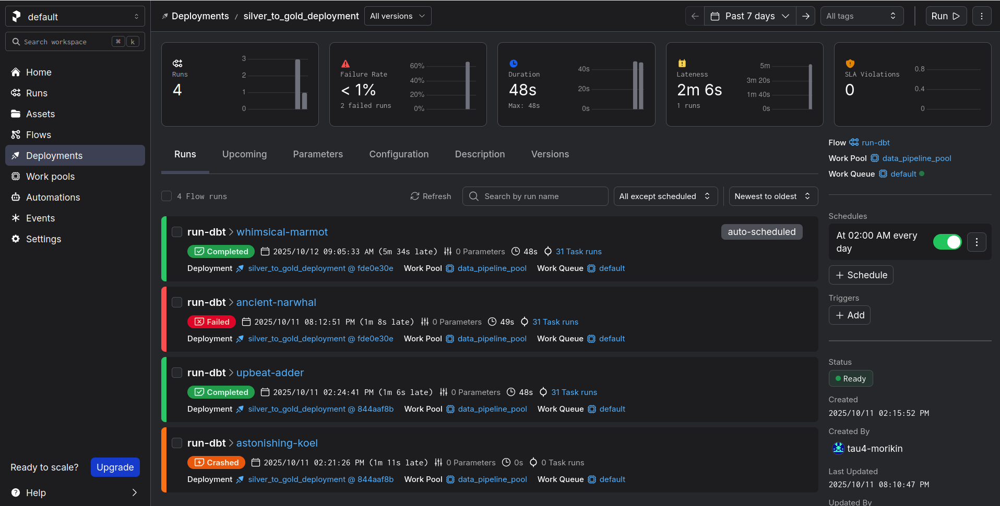
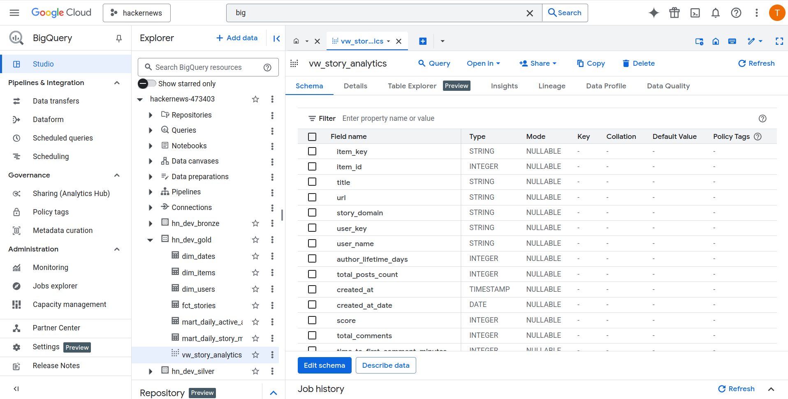

## Step 6: Gold Layer - dbt Dimensional Modeling

### Objective

With the foundational Star Schema (dimensions and facts) established in the previous step, our objective here is to complete the Gold Layer. This involves building a final, denormalized view optimized for Business Intelligence (BI) tools and fully automating the entire dbt transformation pipeline using Prefect. The outcome of this step is a set of reliable, business-ready data assets that are refreshed automatically.

### 1\. Creating the BI Analytics View

While our Star Schema is great for relational integrity, BI tools like Looker Studio perform best when querying a single, wide, "denormalized" table. This avoids complex joins at query time, leading to faster dashboards. We will create this view using dbt to keep it version-controlled and integrated into our lineage.

#### The `vw_story_analytics` Model

We create a new dbt model, `dbt_hacker_news/models/marts/bi/vw_story_analytics.sql`, specifically for this purpose.

This model acts as a presentation layer. It joins our central `fct_stories` table with the `dim_items` and `dim_users` dimensions to create a single, comprehensive view. Each row in this view represents a story, enriched with all its descriptive attributes (title, author details, domain) and key metrics (score, comment count).

```sql
-- dbt_hacker_news/models/marts/bi/vw_story_analytics.sql
{{
    config(
        materialized='view'
    )
}}

WITH
    fct_stories AS (
        SELECT * FROM {{ ref('fct_stories')}}
    ),
    dim_items AS (
        SELECT * FROM {{ ref('dim_items')}}
    ),
    dim_users AS (
        SELECT * FROM {{ ref('dim_users')}}
    )

SELECT
    -- Story details
    fs.item_key, di.item_id, di.title, di.url, COALESCE(di.domain, 'N/A') AS story_domain,
    -- Author details
    fs.user_key, du.user_name, du.author_lifetime_days, du.total_posts_count,
    -- Time details
    fs.created_at, CAST(fs.created_at AS DATE) AS created_at_date,
    -- Story metrics
    fs.score, fs.total_comments, fs.time_to_first_comment_minutes
FROM fct_stories fs
LEFT JOIN dim_items di ON fs.item_key = di.item_key
LEFT JOIN dim_users du ON fs.user_key = du.user_key
```

After creating this model and its corresponding `schema.yml` file, you can run `dbt run` and `dbt test` locally to verify that the view is created successfully in your BigQuery Gold dataset.

### 2\. Automating dbt Runs with Prefect

To automate our dbt transformations, we will use the `prefect-dbt` integration. This library provides a dedicated `PrefectDbtRunner` that makes it easy to invoke dbt commands within a Prefect flow.

**Important Note on dbt Version:** This project uses **dbt Core** and the modern `prefect-dbt` integration ([version 0.7.0 and later](https://docs.prefect.io/integrations/prefect-dbt#prefect-dbt-0-7-0-and-later)).

#### The `silver_to_gold_flow.py`

We create a new flow file, `orchestration/silver_to_gold_flow.py`, to handle the dbt portion of our pipeline.

**Core Idea:** Instead of relying on a local `profiles.yml` file (which would not exist in a remote execution environment), this flow dynamically generates a **temporary dbt profile** for each run. It pulls the GCP service account credentials securely from the `GcpCredentials` block in Prefect Cloud and writes them to a temporary `profiles.yml` file. This makes the flow self-contained and secure.

The flow then uses `DbtCoreOperation` to execute a sequence of dbt commands:

1.  `deps`: Installs any necessary packages.
2.  `run`: Builds all the dbt models.
3.  `test`: Runs all the data quality tests.

<!-- end list -->

```python
# orchestration/silver_to_gold_flow.py
import os
import yaml
from prefect import flow
from prefect_gcp import GcpCredentials
from prefect_dbt.cli.commands import DbtCoreOperation # Updated import for recent versions
from pathlib import Path

@flow(log_prints=True, name="Silver to Gold dbt Flow")
def silver_to_gold_flow():
    """
    Orchestrates the execution of the dbt project to build the Gold layer.
    """
    gcp_credentials_block = GcpCredentials.load("gcp-creds")
    profiles_dir = Path.home() / ".dbt/" # Use the default dbt profiles directory
    profiles_dir.mkdir(exist_ok=True)

    # Dynamically create the profiles.yml content
    profile = {
        "dbt_hacker_news": {
            "target": "dev",
            "outputs": {
                "dev": {
                    "type": "bigquery",
                    "method": "service-account-json",
                    "project": gcp_credentials_block.project,
                    "keyfile_json": gcp_credentials_block.service_account_info.get_secret_value(),
                    "dataset": "hn_dev_gold", # Target dataset for Gold models
                    "location": "US", # Your BigQuery location
                    "threads": 4,
                }
            },
        }
    }

    # Write the profile to the specified directory
    profiles_path = profiles_dir / "profiles.yml"
    with open(profiles_path, "w") as f:
        yaml.dump(profile, f)

    print(f"Temporarily created dbt profile at {profiles_path}")

    # Define the path to the dbt project directory
    dbt_project_path = Path(__file__).parent.parent / "dbt_hacker_news"

    # Define and run dbt commands
    dbt_commands = [
        "deps",
        "run",
        "test"
    ]
    for command in dbt_commands:
        print(f"--- Running dbt {command} ---")
        result = DbtCoreOperation(
            command=command,
            project_dir=str(dbt_project_path),
            profiles_dir=str(profiles_dir),
            stream_output=True # Stream logs to Prefect UI
        ).run()
        if result.is_failure():
            raise Exception("dbt command failed!")

    print("dbt flow completed successfully.")


if __name__ == "__main__":
    silver_to_gold_flow()
```

### 3\. Deploying the dbt Flow

Finally, we update our `prefect.yaml` file to include a deployment for this new dbt flow.

#### Update `prefect.yaml`

Add the following deployment definition. This will schedule our dbt transformations to run daily at 2:00 AM UTC, after the Bronze-to-Silver process has likely completed.

```yaml
# In prefect.yaml, under the 'deployments:' section
- name: silver-to-gold-deployment
  entrypoint: orchestration/silver_to_gold_flow.py:silver_to_gold_flow
  work_pool:
    name: managed-python-pool # Or your specific work pool name
  schedule:
    - cron: "0 2 * * *" # Run daily at 2:00 AM UTC
      timezone: "UTC"
```

#### Apply the Deployment

Run `prefect deploy` to apply all changes.

```bash
prefect deploy --all
```

After deploying, you can trigger a "Quick Run" from the Prefect UI to test the entire dbt pipeline. Upon successful completion, you will see all your Gold layer models (dimensions, facts, and the BI view) created and validated in your BigQuery Gold dataset.

The following image illustrates the Prefect deployment interface used to trigger and monitor the dbt pipeline execution:



This image shows the resulting Gold models successfully materialized in BigQuery after the pipeline run:



With this step, the core data modeling is complete and fully automated, providing a reliable and up-to-date foundation for our BI dashboard.

---

[← Previous: Step 5 - Transform 2: Silver Layer Modeling with dbt](./05-silver-modeling.md)

[Next: Step 7 - BI with Looker Studio →](./07-business-intelligence.md)
